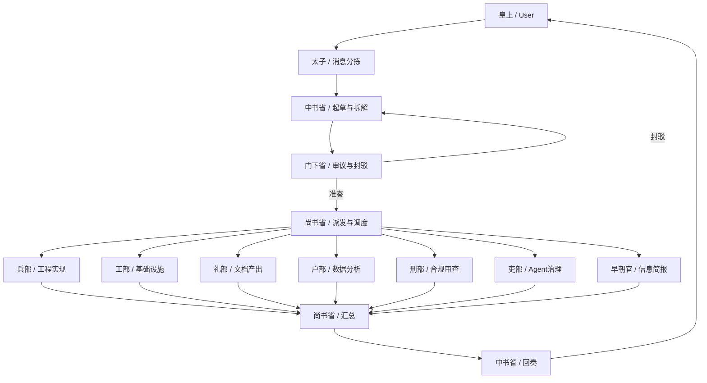

<h1 align="center">⚔️ Edict 2.0 · 三省六部 AI 协作框架</h1>

<p align="center">
  <strong>后来者维护版：在保留原项目精神的基础上，做历史口径校准与架构表达升级。</strong>
</p>

<p align="center">
  <a href="#v20">2.0 版本声明</a> ·
  <a href="#repo">公开仓库</a> ·
  <a href="#history">历史真实性说明</a> ·
  <a href="#arch20">架构图 2.0</a> ·
  <a href="#quickstart">快速开始</a> ·
  <a href="#docs-index">文档索引</a>
</p>

<p align="center">
  
  
  
  
</p>

---

<a id="v20"></a>

## 🆕 2.0 版本声明

- 本仓库是 **Edict 2.0（后来者维护版）**，主要由后续维护者持续更新。
- 当前维护者（后来者）：**N1nEmAn**。
- 原项目与核心创意来自原作者 **cft0808**。
- 2.0 的关键目标：
  - 明确三省六部的历史语义，避免“三省并行决策”误读。
  - 将架构图从“口号化表达”升级为“可执行流程图 + 权限约束”。
  - 同步修订 README、架构文档与演示数据，保持一致口径。

---

<a id="repo"></a>

## 🌐 公开仓库

- 2.0 维护仓库（公开）：`https://github.com/N1nEmAn/edict-2.0`
- 原始仓库（公开）：`https://github.com/cft0808/edict`

> 致谢：本项目 2.0 基于原作者开源成果继续演进，遵循 MIT License。

---

<a id="history"></a>

## 📜 历史真实性说明

三省六部被用于本项目时，遵循以下历史口径：

1. **隋创唐成**：制度基础形成于隋，组织化成熟于唐。
2. **三省并非同职并行**：主链路是“中书起草 -> 门下审议封驳 -> 尚书执行派发”。
3. **并行主要发生在执行层**：尚书省统筹下，诸部可以并行推进各自任务。
4. **本项目是工程映射，不是历史复刻**：我们保留制度逻辑，适配现代 AI 协作场景。

### 史料参考（用于口径校准）

- 《隋书·百官志》
- 《旧唐书·职官志》
- 《新唐书·百官志》
- 《资治通鉴》（隋唐相关卷）

---

<a id="arch20"></a>

## 🏛️ 架构图 2.0



### 流转规则（2.0）

- 门下省审议是必经环节，不可跳过。
- 中书省不能直接指挥诸部；诸部不能越级回中书。
- 尚书省负责派发与汇总，不负责替代门下省审议。
- 封驳后必须回到中书省重规划，再次走审议链路。

---

## ✨ 能力概览

- 制度化协作：三省主链路 + 执行层并行。
- 强制质量门：门下省审议与封驳机制。
- 实时看板：任务、活动流、健康状态可观测。
- 可干预执行：支持叫停 / 取消 / 恢复。
- 多模型协同：不同 Agent 可配置不同 LLM。
- Skills 扩展：支持远程引入技能能力。

---

<a id="quickstart"></a>

## 🚀 快速开始

### 方式 A：Docker 体验（最快）

```bash
docker run -p 7891:7891 cft0808/edict
```

> 说明：当前公开镜像沿用原项目镜像名，2.0 文档与流程口径已在本仓库更新。

### 方式 B：源码安装（推荐 2.0）

```bash
git clone https://github.com/N1nEmAn/edict-2.0.git
cd edict-2.0
chmod +x install.sh && ./install.sh
```

安装后可按需启动（示例）：

```bash
# 终端 1：数据刷新循环
bash scripts/run_loop.sh

# 终端 2：看板服务
python3 dashboard/server.py
```

默认看板地址：`http://127.0.0.1:7891/dashboard/`

---

<a id="docs-index"></a>

## 📚 文档索引

- 架构总文档：`docs/task-dispatch-architecture.md`
- 快速上手：`docs/getting-started.md`
- 项目路线图：`ROADMAP.md`
- 贡献指南：`CONTRIBUTING.md`

---

## 🧭 2.0 与原版差异

- 增加“后来者维护版”与来源声明。
- 统一历史口径：强调三省决策链、执行层并行。
- 更新 README 架构图为 2.0 流程图。
- 同步修正文档和演示文案中易误解表述。

---

## 🤝 致谢

- 原作者：**cft0808**（原项目发起与核心实现）
- 后续维护：2.0 fork 维护者与贡献者

如果你认同“制度化协作 > 自由放养”，欢迎提交 Issue / PR 一起完善 2.0。

---

## 📄 License

MIT License
